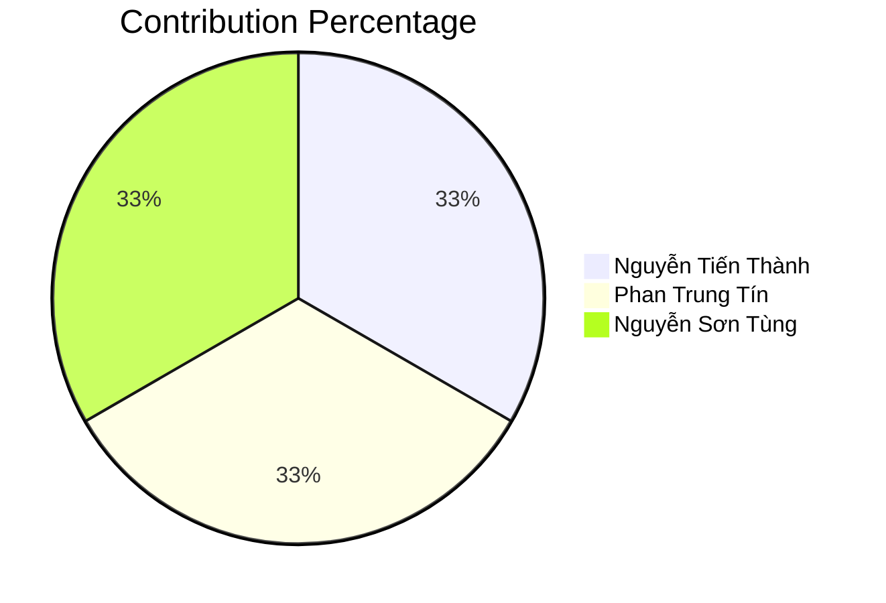

# Final project Self-assessment report

Team: 23120358-23120372-23120399

GitHub repo URL: https://github.com/tinphan247/Restaurant-WEB.git

# **TEAM INFORMATION**

| Student ID | Full name | Git account | Contribution | Contribution percentage (100% total) | Expected total points | Final total points |
| :---- | :---- | :---- | :---- | :---- | :---- | :---- |
| 23120358 | Nguyễn Tiến Thành | TienThanhNguyen | - Xử lý bảo mật, mã QR, sinh và xác thực token truy cập bàn - Quản lý triển khai, cấu hình hosting/public URL - Xây dựng và quản lý module Menu Items (CRUD, filter, sort, pagination, visibility rules) - Quản lý và triển khai hệ thống trên Vercel (Backend/Frontend) - Thiết kế, xây dựng DB và backend cho Order (CRUD, trạng thái, liên kết user/table) - Xây dựng giao diện tạo đơn hàng, lịch sử đơn hàng, kết nối API Order - Quản lý module Order & Review (CRUD, WebSocket, frontend, migration, seed) - Xây dựng chức năng xem lịch sử đơn hàng, phân trang review, triển khai hệ thống lên môi trường public | 33.333% | 9.65 |  |
| 23120372 | Phan Trung Tín | tinphan247 | - Xây dựng hệ thống lõi, quản lý bàn (CRUD, kiểm tra dữ liệu, giao diện admin) - Xây dựng API quản trị danh mục (CRUD, kiểm tra dữ liệu, soft delete, displayOrder) - Phát triển giao diện quản lý danh mục, CategoryForm, tích hợp API - Quản lý hình ảnh (upload, giới hạn dung lượng, thiết lập ảnh chính) - Thiết kế, xây dựng DB và backend cho User/Auth (migration, seed, entity, controller, service) - Triển khai module Auth (đăng ký, đăng nhập, JWT) - Xây dựng giao diện đăng ký, đăng nhập, profile, kết nối API - Xây dựng API Waiter/Kitchen, WebSocket notification, giao diện waiter/kitchen - Thiết kế migration/schema, seed cho waiter, kitchen, table - Quản lý Menu: paging, sort, fuzzy search - Phát triển Authentication: xác thực email, quên mật khẩu, đăng nhập, phân quyền - Xây dựng chức năng tài khoản khách hàng: cập nhật hồ sơ, đổi mật khẩu, upload avatar, xem lịch sử đơn hàng | 33.333% | 9.65 |  |
| 23120399 | Nguyễn Sơn Tùng | NguyenSonTung16 | - Xây dựng công cụ xuất dữ liệu, giao diện hiển thị mã QR, xuất PNG/PDF - Rà soát, tinh chỉnh, tích hợp mã nguồn, bổ sung yêu cầu còn thiếu - Quản lý nhóm tùy chọn (Modifier Groups), options (min/max selection, tính giá) - Phát triển endpoint /api/menu, giao diện GuestMenuPage, tối ưu truy vấn - Thiết kế, xây dựng DB và backend cho Payment (migration, seed, module, mock API Stripe/MoMo) - Phát triển giao diện thanh toán, trạng thái thanh toán, kết nối API Payment - Hoàn thiện module Payment, tích hợp cổng thanh toán, xây dựng module Report (doanh thu, best seller) - Phát triển dashboard báo cáo, kết nối API Payment/Report - Thiết kế migration/schema, seed cho payment, report - Quản lý tài khoản Admin, Waiter, Kitchen Staff (CRUD, update profile) - Xây dựng chức năng khách hàng yêu cầu thanh toán/bill, xử lý luồng thanh toán | 33.333% | 9.65 |  |

## **Contribution Chart**

# **FEATURE LIST**

**Project:** Smart Restaurant - QR Menu Ordering System

Students must input minus points to every uncompleted feature in the SE column.

\*SE: Self-evaluation

\*TR: Teacher review

| ID | Features | Grade |  |  | Notes |
| ----- | :---- | ----- | :---- | :---- | :---- |
|  |  | **Point** | **SE\*** | **TR\*** |  |
| **1** | **Overall requirements** |  |  |  |  |
|  | User-centered design | \-5 | 0 |  | Built with user experience in mind, not just feature list. Focus on solving real restaurant problems: seamless QR ordering, efficient waiter workflow, real-time kitchen coordination, and convenient payment options |
|  | Database design | \-1 | 0 |  | Database with tables: users, restaurants, menus, menu_items, categories, modifiers, tables, orders, order_items, payments |
|  | Database mock data | \-1 | 0 |  | Sample restaurants, menu items, categories, tables, and test orders |
|  | Website layout | \-2 | 0 |  | Two layouts: Customer mobile ordering interface and Admin dashboard |
|  | Website architect | \-3 | 0 |  | Based on MVC architecture. Clear separation of concerns with controllers, services, repositories. Client-side validation, Input validation, Business rule validation |
|  | Website stability and compatibility | \-2 | 0 |  | Mobile-first responsive design, tested on Chrome and Safari |
|  | Document | \-1 | 0 |  | Clear documentation for developers and users: setup guide, API endpoints, database design, system architecture, user guide |
|  | Demo video | \-5 | 0 |  | Video demonstrating all features: restaurant signup, menu management, QR ordering, payment, KDS |
|  | Publish to public hosts | \-1 | 0 |  | Deployed to a public hosting service with accessible URL |
|  | Development progress is recorded in Github | \-7 | 0 |  | Git history with meaningful commits, branches for features, pull requests |
| **2** | **Guest features (Customer Ordering)** |  |  |  |  |
|  | Home page (Menu page) | \-0.25 | 0 |  | Restaurant menu page loaded via QR code scan with categories and items |
|  | View list of menu items | \-0.25 | 0 |  | Display menu items with images, prices, descriptions |
|  | Filter menu items by |  |  |  | A combination of the criteria |
|  | › Item name | \-0.25 | 0 |  | Search menu items by name |
|  | › Category | \-0.25 | 0 |  | Filter by food categories (Appetizers, Main Dishes, Drinks, Desserts) |
|  | Sort menu items by popularity | \-0.25 | 0 |  | Sort by most ordered items |
|  | › Chef recommendation | \-0.25 | 0 |  | Filter/highlight items marked as chef's recommendations |
|  | Menu item paging | \-0.75 | 0 |  | Pagination for large menus with infinite scroll. URL updated on search/filter/paging |                 
|  | View menu item details | \-0.25 | 0 |  | Item detail page with full description, modifiers, allergen info |                                 
|  | View menu item status | \-0.25 | 0 |  | Display item availability status (Available, Unavailable, Sold out) |                             
|  | Show related menu items | \-0.25 | -0.25 |  | Suggest items from same category or popular pairings |                                           
|  | View list of item reviews | \-0.5 | 0 |  | Customer reviews for menu items with pagination |                                                
|  | Add a new item review | \-0.25 | 0 |  | Logged-in customers can review items they ordered |                                              
|  | Shopping cart (Order Cart) |  |  |  |  |
|  | › Add a menu item to the Cart | \-0.25 | 0 |  | Add items with quantity selection |
|  | › View and update items in the Cart | \-0.5 | 0 |  | Cart summary with items, quantities, modifiers, prices. Update quantity with auto-update totals |
|  | Ordering and payment (Dine-in) |  |  |  |  |
|  | › Bind the shopping cart to the table session | \-0.25 | 0 |  | Cart persists for table session |
|  | › Input order details (notes, special requests) | \-0.25 | -0.25 |  | Guest name, special instructions field |                            
|  | › Add items to current order | \-0.25 | 0 |  | Customers can add more items to their unpaid order (single order per table session) |      
|  | › View order status | \-0.25 | 0 |  | Guest can track order status (Received → Preparing → Ready) |
|  | › View order details | \-0.25 | 0 |  | Order confirmation with items, total, table number |
|  | › Request bill | \-0.25 | 0 |  | Customer requests bill when ready to pay |                                                                  
|  | › Process payment after meal | \-0.25 | -0.1 |  | Stripe payment processing after dining |                                                      
| **3** | **Authentication and authorization** |  |  |  |  |
|  | Use a popular authentication library | \-1 | 0 |  | Passport.js with JWT strategy |
|  | Registration (Customer Signup) | \-0.5 | 0 |  | Customer registration with email/password. Real-time email availability check |            
|  | Verify user input: password complexity, full name | \-0.25 | 0 |  | Password rules, required fields validation |
|  | Account activation by email | \-0.25 | 0 |  | Email verification link sent on signup |                                                    
|  | Social Sign-up/Sign-In | \-0.25 | -0.25 |  | Google OAuth integration |                                                                       
|  | Login to the website | \-0.25 | 0 |  | JWT-based authentication for admin/staff |                
|  | Authorize website features | \-0.25 | 0 |  | Role-based access control (Admin, Waiter, Kitchen Staff, Customer) |                           
|  | Forgot password by email | \-0.25 | 0 |  | Password reset via email link |                           
| **4** | **Features for logged-in users (Customers)** |  |  |  |  |
|  | Update user profile | \-0.25 | 0 |  | Customer can update name, preferences |                                                             
|  | Verify user input | \-0.25 | 0 |  | Input validation on profile updates |                                                                    
|  | Update the user's avatar | \-0.25 | 0 |  | Profile photo upload |                                                                        
|  | Update password | \-0.25 | 0 |  | Change password with old password verification |                                                         
|  | Order history and tracking |  |  |  |  |
|  | › View order history | \-0.25 | 0 |  | List of past orders linked to user account |                                                         
|  | › View item processing status | \-0.25 | 0 |  | Track individual item status within an order (Queued, Cooking, Ready) |
|  | › Real-time Order Updates | 0.5 | 0 |  | WebSocket-based live order status updates for customers |
| **5** | **Administration features (Restaurant Admin)** |  |  |  |  |
|  | Create Admin accounts | \-0.25 | 0 |  | Admin creates additional Admin accounts |                                                         
|  | Manage Admin accounts | \-0.25 | 0 |  | View, edit, deactivate Admin accounts |                                                         
|  | Update admin profile | \-0.25 | 0 |  | Restaurant admin profile management |                                                               
|  | Create Waiter accounts | \-0.25 | 0 |  | Admin creates accounts for waiters |                                                       
|  | Create Kitchen Staff accounts | \-0.25 | 0 |  | Admin creates accounts for kitchen staff |      
|  | Manage menu categories | \-0.25 | 0 |  | Create, edit, delete food categories |
|  | View menu item list | \-0.5 | 0 |  | List all menu items with filters and pagination |
|  | Filter menu items by name, category | \-0.25 | 0 |  | Search and filter menu items |
|  | Sort menu items by creation time, price, popularity | \-0.25 | 0 |  | Sortable menu item list |
|  | Create a new menu item | \-0.25 | 0 |  | Add item with name, price, description, category, prep time |
|  | Upload multiple menu item photos | \-0.5 | 0 |  | Multi-image upload for menu items |
|  | Add menu item to category with modifiers | \-0.25 | 0 |  | Assign categories and create modifier groups (Size, Extras) |
|  | Menu Item Modifiers | 0.5 | 0 |  | Modifier groups (Size, Extras) with price adjustments |
|  | Specify menu item status | \-0.25 | 0 |  | Available, Unavailable, Sold out |
|  | Verify user input | \-0.25 | 0 |  | Input validation for menu items |
|  | Update a menu item | \-0.25 | 0 |  | Edit existing menu items |
|  | Add, remove menu item photos | \-0.25 | 0 |  | Manage item images |
|  | Change menu item category, modifiers | \-0.25 | 0 |  | Update item categorization |
|  | Update menu item status | \-0.25 | 0 |  | Toggle availability |
|  | Verify user input | \-0.25 | 0 |  | Validation on updates |
|  | Customer orders (Order Management) |  |  |  |  |
|  | › View list of orders sorted by creation time | \-0.25 | 0 |  | Order list in KDS sorted by time |                                    
|  | › Filter orders by status | \-0.25 | 0 |  | Filter: Received, Preparing, Ready, Completed |                                                  
|  | › View order details | \-0.25 | 0 |  | Full order details with items, modifiers, notes |
|  | › Update order status | \-0.25 | 0 |  | Progress order through states: Received → Preparing → Ready → Completed |
|  | › Kitchen Display System (KDS) | -0.5 | 0 |  | Real-time order display for kitchen staff with sound notifications |
|  | › Order Timer and Alerts | -0.25 | -0.25 |  | Highlight orders exceeding item's configured prep time |                                       
|  | Table Management |  |  |  |  |
|  | › Create, edit, deactivate tables | -0.5 | 0 |  | Create, edit, deactivate tables with capacity and location |
|  | › QR Code Generation | -0.5 | 0 |  | Generate unique QR codes per table with signed tokens |
|  | › QR Code Download/Print | -0.25 | 0 |  | Download QR as PNG/PDF for printing |
|  | › QR Code Regeneration | -0.25 | 0 |  | Regenerate QR and invalidate old codes |
|  | Reports |  |  |  |  |
|  | › View revenue report in time range | \-0.25 | 0 |  | Daily, weekly, monthly revenue reports |
|  | › View top revenue by menu item in time range | \-0.25 | 0 |  | Best-selling items report |
|  | › Show interactive chart in reports | \-0.25 | 0 |  | Chart.js/Recharts for analytics dashboard (orders/day, peak hours, popular items) |
| **7** | **Waiter features** |  |  |  |  |
|  | View pending orders | \-0.25 | 0 |  | List of new orders waiting for waiter acceptance |
|  | Accept/Reject order items | \-0.25 | 0 |  | Waiter can accept or reject individual order items |
|  | Send orders to kitchen | \-0.25 | 0 |  | Forward accepted orders to Kitchen Display System |
|  | View assigned tables | \-0.25 | 0 |  | See tables assigned to the waiter |
|  | Mark orders as served | \-0.25 | 0 |  | Update order status when food is delivered to table |
|  | Bill Management |  |  |  |  |                                                                                                                
|  | › Create bill for table | \-0.25 | 0 |  | Generate bill with all order items, subtotal, tax, and total |
|  | › Print bill | \-0.25 | 0 |  | Print bill to thermal printer or download as PDF |
|  | › Apply discounts | \-0.25 | -0.25 |  | Apply percentage or fixed amount discounts to bill |                  
|  | › Process payment | \-0.25 | 0 |  | Mark bill as paid (cash, card, or e-wallet) |                                                   
| **8** | **Advanced features** |  |  |  |  |
|  | Payment system integration | 0.5 | 0.5 |  | Payment gateway integration (ZaloPay, MoMo, VNPay, Stripe, etc.) - at least 1 required |
|  | Fuzzy search | 0.25 | 0 |  | Fuzzy matching for menu item search with typo tolerance |                                                       
|  | Use memory cache to boost performance | 0.25 | 0 |  | Redis for menu caching and session management |                                           
|  | Analyze and track user actions | 0.25 | 0 |  | Google Analytics for QR scan tracking, order conversion metrics |                                
|  | Dockerize your project | 0.25 | 0 |  | Docker containers for backend, frontend, database |                                                      
|  | CI/CD | 0.25 | 0 |  | GitHub Actions for automated testing and deployment |                                                                     
|  | Monitoring and logging | 0.25 | 0.1 |  | Centralized application logs, metrics, dashboards, and alerting (e.g., ELK/EFK, Prometheus/Grafana) |    
|  | BI integration | 0.25 | 0 |  | Connect operational data to BI tools for reporting and dashboards (e.g., Power BI, Tableau, Metabase) |          
|  | Advanced authorization (RBAC) | 0.25 | 0.1 |  | Fine-grained role/permission management for Admin/Chef/Waiter and other staff roles |           
|  | WebSocket real-time updates | 0.5 | 0.5 |  | Socket.IO for real-time features: KDS order notifications, customer order status tracking, waiter new order alerts, kitchen ready notifications, table status updates |
|  | Multi-tenant support | 0.5 | 0 |  | Multiple restaurants (tenants) with strict data isolation; tenant-scoped RBAC and configuration |
|  | Multilingual support | 0.25 | 0 |  | i18n for English/Vietnamese language selection |

# **GIT HISTORY**

## **Contributors**

| Avatar | Username | Commits | Additions | Deletions |
| :--- | :--- | :--- | :--- | :--- |
| | NguyenSonTung16 | 60 | 54693 | 28830 |
| | tinphan247 | 22 | 43064 | 950 |
| | TienThanhNguyen | 69 | 9809 | 1835 |

## **Commits**

*List significant commits here with format:*

| Date | Author | Commit Message | Files Changed |
| :---- | :---- | :---- | :---- |
| 2026-01-19 | NguyenSonTung16 | delete unnecessary files | 70 |
| 2026-01-19 | TienThanhNguyen | Fix: Hardcode frontend URL in PDF generator  1 file changed, 2 insertions(+), 2 deletions(-) | 0 |
| 2026-01-19 | TienThanhNguyen | Fix: Update fallback FRONTEND_URL in PDF generator for QR codes  1 file changed, 75 insertions(+), 75 deletions(-) | 0 |
| 2026-01-19 | TienThanhNguyen | Fix: Performance Optimization & Avatar Upload (Squashed) | 18 |
| 2026-01-19 | TienThanhNguyen | Feat: Complete Auth Flow with Guest Redirect & Safe Auto-Verify | 6 |
| 2026-01-19 | NguyenSonTung16 | Fix: Identity Swap, Avatar Persistence & UI Cleanup  - Fix Identity Swap: Backend now correctly uses JWT sub for User ID.  - Fix Avatar Persistence: Added avatar to login response and service query.  - UI: Adjusted Logout button position and removed debug logs. | 9 |
| 2026-01-19 | TienThanhNguyen | Fix: Ignore local .env files  1 file changed, 4 insertions(+) | 0 |
| 2026-01-19 | TienThanhNguyen | Update: Guest Menu UI (Responsive), Payment Options, and System Fixes | 35 |
| 2026-01-19 | NguyenSonTung16 | add user profile | 7 |
| 2026-01-19 | NguyenSonTung16 | synchronize data when profile information changes in admin profile | 7 |
| 2026-01-19 | TienThanhNguyen | Prepare for Render deployment with SendGrid | 6 |
| 2026-01-18 | TienThanhNguyen | Prepare for Render deployment | 5 |
| 2026-01-17 | NguyenSonTung16 | Fix: update seeders to match migrations and data relations, add set up guide file | 9 |
| 2026-01-17 | NguyenSonTung16 | feat: update staff role management, fix order sorting, clarify search, review requirements  - Merge branch account-management and fix-log-in-flow | 0 |
| 2026-01-16 | tinphan247 | feat(auth): add reset password fields and fix forgot password flow | 20 |
| 2026-01-16 | tinphan247 | feat(auth): add email verification on signup | 26 |
| 2026-01-16 | tinphan247 | feat(menu): add fuzzy search with typo tolerance for menu items | 13 |
| 2026-01-16 | TienThanhNguyen | feat(review): Set constraint not null for content of review  1 file changed, 6 insertions(+), 3 deletions(-) | 0 |
| 2026-01-16 | tinphan247 | feat(admin): add staff account management for waiter and kitchen roles  - Add admin APIs to create, list, update, and delete staff accounts - Extend user roles with WAITER and KITCHEN_STAFF - Secure staff management endpoints with admin-only guards - Add admin UI for staff management (create, edit, delete) - Integrate staff APIs with frontend using React Query | 16 |
| 2026-01-16 | tinphan247 | Fix 'Save' button not working in Profile Info section by adding data-section attribute and a hidden submit button. | 2 |
| 2026-01-16 | TienThanhNguyen | feat: Remove history at paymentpage and delete function at account management page | 6 |
| 2026-01-16 | tinphan247 | refactor(profile): clean section-based form handling | 3 |
| 2026-01-16 | tinphan247 | refactor(profile): edit profile sections on demand  - Switch profile page to view/edit per section - Enable edit mode only when section is clicked - Improve admin profile UX clarity | 11 |
| 2026-01-16 | tinphan247 | fix(profile): keep cloudinary avatar after reload  - normalize uploadAvatar response - sync profile.avatar with GET /admin/profile | 8 |
| 2026-01-16 | NguyenSonTung16 | Account management: improve error handling for duplicate email, frontend notification, RESTful backend | 14 |
| 2026-01-16 | tinphan247 | fix(frontend): correct api endpoints and methods for admin profile  - Update App.tsx to use AdminProfilePage component - Remove /update suffix from profile update patch request - Change password and email change methods from POST to PATCH to match backend - Fix avatar upload field name to 'avatar' - Ensure all profile requests include auth headers | 4 |
| 2026-01-16 | tinphan247 | feat(admin-profile): implement full admin profile management (password, email, avatar) | 31 |
| 2026-01-16 | NguyenSonTung16 | feat: export user name and email to invoice PDF; add download invoice button for completed orders in waiter history | 6 |
| 2026-01-16 | TienThanhNguyen | feat(payment): remove history tab from payment page | 2 |
| 2026-01-16 | NguyenSonTung16 | feat: add guest bill request feature (alert waiter when guest requests invoice)  1 file changed, 10 insertions(+), 6 deletions(-) | 0 |
| 2026-01-15 | NguyenSonTung16 | feat: export order invoice PDF, add endpoint, frontend button, and fix Dependency Injection | 8 |
| 2026-01-15 | NguyenSonTung16 | Fix authentication bugs and improve login/register UI  - Fix issue where login state on one screen affected other screens - Hide history and protected data when user is not logged in - Improve UI layout and consistency for login and register screens | 17 |
| 2026-01-15 | TienThanhNguyen | feat(order-history): track user-specific orders | 10 |
| 2026-01-15 | TienThanhNguyen | feat: enhance reviews and fix reports module  - Displays the reviewer's name in the review list.  - Fixes a 500 internal server error in the admin revenue report. | 12 |
| 2026-01-14 | NguyenSonTung16 | Refactor seeders: split order_items into separate file, add more sample data for completed orders to support best seller report | 20 |
| 2026-01-14 | NguyenSonTung16 | Move OrderDetailModal outside showHistory condition, clean up modal state logic | 5 |
| 2026-01-14 | TienThanhNguyen | feat(waiter): toast on complete & sync order card status for realtime | 12 |
| 2026-01-14 | NguyenSonTung16 | fix(waiter, kitchen): emit order_status_update to waiter when order is marked as READY in kitchen for real-time update | 17 |
| 2026-01-14 | NguyenSonTung16 | Fix: Pass correct tableNumber to PaymentPage and simplify table_id type handling | 3 |
| 2026-01-13 | NguyenSonTung16 | Merge waiter and kitchen features, fix realtime order sync and related functionalities. Refactor event emit for newOrder to correct namespace, resolve DI and module import issues for WaiterGateway. Ensure instant order updates for waiter dashboard without refresh. | 90 |
| 2026-01-13 | NguyenSonTung16 | Merge waiter and kitchen features, fix realtime order sync and related functionalities. Refactor event emit for newOrder to correct namespace, resolve DI and module import issues for WaiterGateway. Ensure instant order updates for waiter dashboard without refresh. | 43 |
| 2026-01-13 | TienThanhNguyen | feat: improve guest tracking UI and simplify order statuses | 8 |
| 2026-01-13 | TienThanhNguyen | feat(order): enhance guest payment flow and admin status controls | 14 |
| 2026-01-13 | TienThanhNguyen | Merge branch 'main' into feat/payment-db-production | 0 |
| 2026-01-12 | TienThanhNguyen | feat(order): integrate websocket for real-time order updates | 10 |
| 2026-01-12 | TienThanhNguyen | feat(order): integrate websocket for real-time order updates | 9 |
| 2026-01-09 | NguyenSonTung16 | feat: implement reports module with revenue and best-sellers views  - Add report views: v_revenue_daily, v_best_sellers - Backend: report service with daily/weekly/monthly aggregation - Frontend: RevenueChart, BestSellersTable components - Fix: timezone date formatting, safe Recharts tooltip - Add: test data for reports (orders, order_items, menu_items, categories) - Format: weekly periods as YYYY-MM-tuần X (week of month) | 15 |
| 2026-01-09 | NguyenSonTung16 | renamed all screen in customer flow  1 file changed, 5 insertions(+), 5 deletions(-) | 0 |
| 2026-01-09 | NguyenSonTung16 | fix: add double-check payment status before cancelling order  - Prevent cancelling order if payment became successful during delay period - Add safety check for late IPN callbacks - Skip cancellation if payment status is SUCCESS  1 file changed, 9 insertions(+) | 0 |
| 2026-01-09 | NguyenSonTung16 | feat: add delayed order cancellation after payment expires  - Add expiredAt field to Payment entity - Implement 2-minute delay before cancelling order after payment expires - Add PaymentCancelExpiredTask cron (runs every minute) - Update migrations: add expired_at column, fix order statuses - Update seed data with UUID menu_item_id and payment examples - Fix order creation flow: ensure order exists before payment | 21 |
| 2026-01-08 | NguyenSonTung16 | feat(payment): migrate to DB with MoMo IPN production-ready  - Replace in-memory with TypeORM database - IPN handler returns ACK 200 immediately (prevent MoMo retry) - Race condition handling: check status before update - Payment timeout cron: pending  expired after 5 minutes - Comprehensive logging for financial audit trail - Add payment entities, repository, task scheduler - Update DTO with proper validation | 25 |
| 2026-01-08 | NguyenSonTung16 | Refactor payment workflow with integrated cart and method selection | 5 |
| 2026-01-08 | NguyenSonTung16 | Fix review schema & improve error handling | 7 |
| 2026-01-07 | TienThanhNguyen | fix(core): resolve review entity relation and persist user auth for submissions | 4 |
| 2026-01-07 | TienThanhNguyen | feat(review): add admin review management and integrate with guest menu | 5 |
| 2026-01-07 | TienThanhNguyen | feat(order): implement order status updates and order detail view | 5 |
| 2026-01-07 | TienThanhNguyen | feat(review): implement average rating calculation | 4 |
| 2026-01-07 | TienThanhNguyen | feat(review): implement create review functionality | 6 |
| 2026-01-07 | TienThanhNguyen | feat: implement review list backend and frontend | 15 |
| 2026-01-04 | NguyenSonTung16 | payment: docs and momo flow (api prefix, ngrok, frontend return) | 20 |
| 2026-01-04 | NguyenSonTung16 | Add show/hide password toggle with SVG icons | 2 |
| 2026-01-04 | NguyenSonTung16 | Add guest login/logout flow in guest menu page | 5 |
| 2026-01-03 | tinphan247 | merge code  1 file changed, 14 deletions(-) | 0 |
| 2026-01-03 | tinphan247 | Merge branch 'main' of https://github.com/tinphan247/Restaurant-WEB | 0 |
| 2026-01-03 | tinphan247 | add register and profile page | 12 |
| 2026-01-03 | NguyenSonTung16 | feat: add mobile bottom navigation and update cart UI | 4 |
| 2026-01-03 | NguyenSonTung16 | fix: validate JWT token format in decodeJwtPayload to prevent undefined payload error  1 file changed, 18 insertions(+), 1 deletion(-) | 0 |    
| 2026-01-03 | NguyenSonTung16 | fix error 400 when using url from table qr | 2 |
| 2026-01-03 | TienThanhNguyen | Fix QR loading error | 8 |
| 2026-01-03 | tinphan247 | fix: prevent direct access to admin pages without login | 3 |
| 2026-01-03 | tinphan247 | fix: prevent direct access to admin pages without login  1 file changed, 105 insertions(+), 111 deletions(-) | 0 |
| 2026-01-02 | NguyenSonTung16 | fix hash value of user.seed, create env example | 5 |
| 2026-01-02 | tinphan247 | fix: remove google login entry point to prevent 404 error | 2 |
| 2026-01-02 | tinphan247 | merge: resolve conflicts with team member | 0 |
| 2026-01-02 | tinphan247 | feat: complete login and logout logic | 21 |
| 2026-01-02 | TienThanhNguyen | feat(order): Finished order management | 18 |
| 2025-12-30 | NguyenSonTung16 | add payment method screen | 3 |
| 2025-12-29 | NguyenSonTung16 | feat(payment): add basic backend/frontend code for payment feature  - Backend: Add payment module with controller, service, repository, entity, mock strategies (Stripe, MoMo), interface, and DTOs. - Frontend: Add PaymentPage, PaymentForm, PaymentStatus, usePayment hook, paymentApi service, and payment types. - Implements payment creation flow, status display, and mock gateway integration. - Ensures clear separation of backend, frontend, database, and docs as required in week 1 assignment. | 28 |
| 2025-12-28 | NguyenSonTung16 | docs: add detailed implementation plan for final project submission | 7 |
| 2025-12-28 | NguyenSonTung16 | fix SSL issue in app.module.ts | 4 |
| 2025-12-27 | TienThanhNguyen | fix: debounce guest menu search and prevent ui flickering | 3 |
| 2025-12-27 | TienThanhNguyen | fix: return detailed error message for upload failure | 2 |
| 2025-12-27 | TienThanhNguyen | fix: replace streamifier with native stream and add logs | 2 |
| 2025-12-27 | TienThanhNguyen | fix: add error logging for cloudinary upload | 2 |
| 2025-12-27 | TienThanhNguyen | fix: install backend dependencies and relax cors | 4 |
| 2025-12-27 | TienThanhNguyen | feat: integrate cloudinary for persistent image storage | 6 |
| 2025-12-27 | TienThanhNguyen | fix: debounce search input in photo page to prevent flickering  1 file changed, 17 insertions(+), 12 deletions(-) | 0 |
| 2025-12-27 | TienThanhNguyen | fix: enable static file serving in serverless function  1 file changed, 22 insertions(+), 2 deletions(-) | 0 |
| 2025-12-27 | TienThanhNguyen | fix: remove duplicated api path in modifierApi  1 file changed, 1 insertion(+), 1 deletion(-) | 0 |
| 2025-12-27 | TienThanhNguyen | fix: allow guest menu to load without restaurantId  1 file changed, 2 insertions(+), 2 deletions(-) | 0 |
| 2025-12-27 | TienThanhNguyen | fix: replace all localhost references with production urls | 7 |
| 2025-12-27 | TienThanhNguyen | Frontend: Set default Backend URL to fix 405 error | 5 |
| 2025-12-27 | TienThanhNguyen | Frontend: Use VITE_BACKEND_URL for API calls | 5 |
| 2025-12-27 | TienThanhNguyen | Frontend: Fix all .map() crashes in Grids and Managers | 3 |
| 2025-12-27 | TienThanhNguyen | Frontend: Add defensive coding (optional chaining) to prevent crashes | 2 |
| 2025-12-27 | TienThanhNguyen | Add error handling for PhotoPage  1 file changed, 8 insertions(+), 3 deletions(-) | 0 |
| 2025-12-27 | TienThanhNguyen | Fix frontend crash on invalid API response and backend build config  1 file changed, 4 insertions(+) | 0 |
| 2025-12-27 | TienThanhNguyen | Fix TypeScript build errors | 2 |
| 2025-12-27 | TienThanhNguyen | Fix wrong import paths to shared types in entities | 7 |
| 2025-12-27 | TienThanhNguyen | Fix circular dependencies and import paths for Vercel deployment | 9 |
| 2025-12-27 | TienThanhNguyen | feat: allow db sync via env var  1 file changed, 3 insertions(+), 1 deletion(-) | 0 |
| 2025-12-27 | TienThanhNguyen | fix: replace localhost with env vars in frontend and update cors | 3 |
| 2025-12-27 | TienThanhNguyen | fix: use string names for relations to fix ReferenceError | 2 |
| 2025-12-27 | TienThanhNguyen | fix: use /tmp for uploads on vercel to avoid EROFS  1 file changed, 12 insertions(+), 1 deletion(-) | 0 |
| 2025-12-27 | TienThanhNguyen | fix: resolve circular dependencies in entities | 5 |
| 2025-12-27 | TienThanhNguyen | fix: correct entity class names in app module  1 file changed, 14 insertions(+), 14 deletions(-) | 0 |
| 2025-12-27 | TienThanhNguyen | fix: disable sync, force ssl, use relative paths, increase limits | 9 |
| 2025-12-27 | TienThanhNguyen | fix: move shared types inside backend package for vercel deployment | 3 |
| 2025-12-27 | TienThanhNguyen | fix: manual entities import and debug mode | 2 |
| 2025-12-27 | TienThanhNguyen | update tsconfig for vercel deployment | 3 |
| 2025-12-27 | TienThanhNguyen | Config to host to vercel | 2 |
| 2025-12-27 | NguyenSonTung16 | xóa file md ko cần thiết | 3 |
| 2025-12-27 | NguyenSonTung16 | Hiển thị ảnh món ăn đúng kích thước, bo góc, nền trắng cho card menu item  - Sửa logic lấy URL ảnh để luôn đúng backend (hỗ trợ biến môi trường) - Trả về primaryPhotoUrl từ backend cho guest menu | 8 |
| 2025-12-27 | NguyenSonTung16 | fix: show correct item count for each category and support photo delete API | 12 |
| 2025-12-26 | TienThanhNguyen | Menu Items CRUD + Business Rules | 28 |
| 2025-12-25 | tinphan247 | feat: hoàn thiện upload ảnh và sửa lỗi ràng buộc database | 32 |
| 2025-12-22 | NguyenSonTung16 | docs: add .env.example templates for setup instructions  - Add backend/.env.example with database, JWT, server config - Add frontend/.env.example with API URL and mock mode option - Include comments explaining each variable - Helps new developers understand required setup | 2 |
| 2025-12-22 | NguyenSonTung16 | chore: add lucide-react and update project structure  - Add lucide-react@0.562.0 for cart icons - Update Week_MenuManagement_split.md: move photos to Person 1 - Lock dependency versions | 3 |
| 2025-12-22 | NguyenSonTung16 | docs: add comprehensive Vietnamese guides  - MODIFIER_EXPLANATION.md: Purpose, flow, UI components, benefits - HOW_TO_ATTACH_MODIFIERS.md: Step-by-step attachment guide - Include API examples, UI walkthrough, mock data setup - Real-world examples for Phở with modifiers - Troubleshooting section | 2 |
| 2025-12-22 | NguyenSonTung16 | feat(frontend): integrate cart with guest menu  - GuestMenuPage: Wrap with CartProvider, add floating cart button - MenuItemCard: Integrate useCart() addItem with modifier validation - CartSidebar: Show cart with item count badge - ScanPage: Add JWT token decoding for mock mode table info - mockData.ts: Add realistic modifiers for Phở, Bún bò, drinks - Display mock mode indicator and table number in header | 4 |
| 2025-12-22 | NguyenSonTung16 | feat(frontend): replace UUID input with searchable dropdown  - AttachModifiersToItem: Load menu items from menuItemApi - Searchable dropdown with real-time filtering - Display format: 'Phở bò tái chín - 65,000đ (Món chính)' - Selected item preview card with name, price, description, ID - Search box: ' Tìm món theo tên...' - Improved UX: no UUID knowledge required for admins  1 file changed, 103 insertions(+), 23 deletions(-) | 0 |
| 2025-12-22 | NguyenSonTung16 | feat(frontend): implement shopping cart system  - Create CartContext with global state management - CartProvider with items, itemCount, totalPrice - Add/remove/update quantity operations - getItemPrice() calculates base + modifier adjustments - CartSidebar component with full UI: - Item list with modifier display - Quantity controls (+/-/remove) - Total price calculation - Clear cart and checkout buttons | 2 |
| 2025-12-22 | NguyenSonTung16 | feat(frontend): add mock data support for APIs  - menuItemApi: buildMockMenuItems() converter from MockMenu data - modifierApi: in-memory mockStorage for groups and attachments - Support VITE_USE_MOCK_MENU environment flag - Fallback to mock data on API errors - Export mockMenuItems for reuse across components | 3 |    
| 2025-12-22 | NguyenSonTung16 | feat(backend): add MenuItemsModule for admin dropdown  - Create MenuItemsModule with MenuItemsController - Add GET /api/admin/menu/items endpoint - Return simplified item list: id, name, price, category, status - Use QueryBuilder with joins for efficient queries - Register MenuItemsModule in app.module.ts | 3 |
| 2025-12-22 | NguyenSonTung16 | perf(backend): optimize ModifierService queries  - Replace find() with QueryBuilder for better performance - Use batch inserts with createQueryBuilder for attach operations - Add transaction for attach/detach to ensure data consistency - Optimize deleteModifierGroup with direct delete (no entity load) - Reduce N+1 queries with proper joins and selects - Use exist() instead of findOne() for validation checks  1 file changed, 102 insertions(+), 111 deletions(-) | 0 |
| 2025-12-22 | NguyenSonTung16 | feat(backend): add AdminAuthGuard and CurrentUser decorator  - Create AdminAuthGuard with placeholder JWT verification - Add CurrentUser decorator to extract user info from request - Update ModifierController to use @UseGuards(AdminAuthGuard) - Replace hardcoded restaurantId with @CurrentUser('restaurantId') - Ready for production JWT implementation | 3 |
| 2025-12-22 | NguyenSonTung16 | feat: implement modifier management (Person 3)  - Backend: 7 endpoints for modifier groups, options, attach/detach to items - Validation: min/max range, isRequired+options, priceAdjustment>=0 - Frontend: CRUD groups/options, attach modifiers UI, sidebar navigation - Client validation: min<=max for multiple, default minSelections=1 when required - Fixed: priceAdjustment toFixed coercion, delete group endpoint - Route: default to /admin dashboard instead of guest menu | 22 |
| 2025-12-22 | NguyenSonTung16 | feat(person3): add modifier management and guest menu  - Add modifier groups, options, and attach to items endpoints - Add public guest menu with filter, sort, pagination - Register modules in AppModule - Remove migrations for consistency | 23 |
| 2025-12-22 | NguyenSonTung16 | Resolve package-lock merge conflicts | 0 |
| 2025-12-22 | NguyenSonTung16 | add menu.d.ts and file .md for work split | 76 |
| 2025-12-20 | TienThanhNguyen | Improve font path detection for Vercel  1 file changed, 21 insertions(+), 14 deletions(-) | 0 |
| 2025-12-20 | TienThanhNguyen | Fix font path resolution for PDF generation  1 file changed, 33 insertions(+), 12 deletions(-) | 0 |
| 2025-12-20 | TienThanhNguyen | Fix missing fonts in Vercel build | 2 |
| 2025-12-20 | TienThanhNguyen | Fix PDF download API URLs | 2 |
| 2025-12-20 | TienThanhNguyen | Fix regenerateAllQrTokens API URL  1 file changed, 1 insertion(+), 1 deletion(-) | 0 |
| 2025-12-20 | TienThanhNguyen | Fix usued interface  1 file changed, 8 deletions(-) | 0 |
| 2025-12-20 | TienThanhNguyen | Fix ScanPage API URL  1 file changed, 7 insertions(+), 9 deletions(-) | 0 |
| 2025-12-20 | TienThanhNguyen | Fix slow api cold  1 file changed, 24 insertions(+), 20 deletions(-) | 0 |
| 2025-12-20 | TienThanhNguyen | Deploy to Vercel | 10 |
| 2025-12-19 | NguyenSonTung16 | feat: implement responsive design and complete table management features  - Add responsive layout for all admin components (mobile-first) * Stack buttons/filters vertically on mobile * Hide less important table columns on small screens * Responsive modals with overflow handling  - Implement QR code management features * Add qrTokenCreatedAt timestamp tracking * Add bulk QR regeneration endpoint and UI * Display QR status and creation time in UI * Enhance JWT payload with restaurantId  - Add bulk export features * Create BulkDownloadActions component (ZIP, bulk PDF) * Implement 2x2 grid PDF layout (4 QR per page) * Update QR URL format with tableId parameter  - UX improvements * Add confirmation dialogs * Reorganize bulk operations in header * Dynamic QR size based on screen width | 15 |
| 2025-12-19 | NguyenSonTung16 | feat(admin): fetch latest table data on QR view; show alert instead of modal on QR regeneration | 3 |
| 2025-12-19 | NguyenSonTung16 | fix(db): temporarily allow NULL on table_number to unblock TypeORM synchronize; will backfill and enforce NOT NULL later  1 file changed, 3 insertions(+), 2 deletions(-) | 0 |
| 2025-12-19 | NguyenSonTung16 | feat(admin): add sort/order controls in FilterBar and set default sorting in AdminPage | 2 |
| 2025-12-19 | NguyenSonTung16 | feat(table): convert tableNumber to number across stack\n\n- Update shared types and DTOs\n- Change entity column to int\n- Adjust search to CAST tableNumber\n- Update QR utils payload type\n- Make TableForm numeric input for tableNumber | 6 |
| 2025-12-19 | NguyenSonTung16 | feat(table): add optional description field across types, backend entity, DTO validation, and admin TableForm UI | 5 |
| 2025-12-19 | NguyenSonTung16 | fix: resolve QR code download and export functionality  - Fix duplicate /api route in export controller - Add FRONTEND_URL config for QR generation - Use relative URLs for Vite proxy compatibility - Generate full QR URLs in PDF/ZIP exports - Improve error handling and UI cleanup | 18 |
| 2025-12-19 | NguyenSonTung16 | feat(admin-dashboard): auto-generate QR when creating table  1 file changed, 62 insertions(+), 43 deletions(-) | 0 |
| 2025-12-18 | TienThanhNguyen | feat(qr-auth): implement QR code generation and verification logic | 24 |
| 2025-12-16 | tinphan247 | feat(table-manager): Complete Table CRUD, fix 500/400 errors, and improve UI/UX | 2 |
| 2025-12-15 | tinphan247 | thay doi giao dien | 9 |
| 2025-12-15 | tinphan247 | feat: Initial setup for Table Manager (User 1) and Monorepo structure | 45 |

---

# **PROJECT SUMMARY**

## System Overview
**Smart Restaurant** is a QR-based menu ordering system for **dine-in service** that enables restaurants to:
- Manage digital menus with categories, items, and modifiers
- Generate unique QR codes for each table
- Allow customers to scan QR, browse menu, and place orders from their phones
- Customers can add items to their current order during their visit (single order per table session)
- Process payments after the meal via payment gateway integration (ZaloPay, MoMo, VNPay, Stripe, etc.) - pay-after-meal model
- Track orders in real-time via Kitchen Display System (KDS)
- View analytics and performance reports

**Note:** This is a single-restaurant system. Multi-tenant support is not included.

## Technology Stack
- **Architecture:** Single Page Application (SPA)
- **Frontend:** ReactJS / NextJS
- **Backend:** NodeJS with Express/similar framework
- **Database:** SQL or NoSQL database
- **Authentication:** Passport.js with JWT
- **Payment:** Payment Gateway (ZaloPay, MoMo, VNPay, Stripe, etc.)
- **Real-time:** Socket.IO / WebSocket
- **Caching:** Redis (optional)
- **Hosting:** Public hosting service

## Key User Flows
1. **Restaurant Setup:** Admin account creation → Admin login → Menu Creation → Table Setup → QR Generation
2. **Customer Registration:** Sign up → Email Verification → Login → Access order history
3. **Customer Ordering (Dine-in):** Scan QR → View Menu → Add to Cart → Submit Items → Track Order → Add More Items → Request Bill → Payment
4. **Waiter Order Acceptance:** Customer Places Order → Waiter Receives Notification → Waiter Reviews → Accept/Reject → Send to Kitchen
5. **Order Processing (Kitchen):** Waiter Accepts Order → Kitchen Receives → Preparing → Ready → Waiter Serves → Completed

---

*Note: Fill in the student information, contribution details, self-evaluation scores, and git history before submission.*
